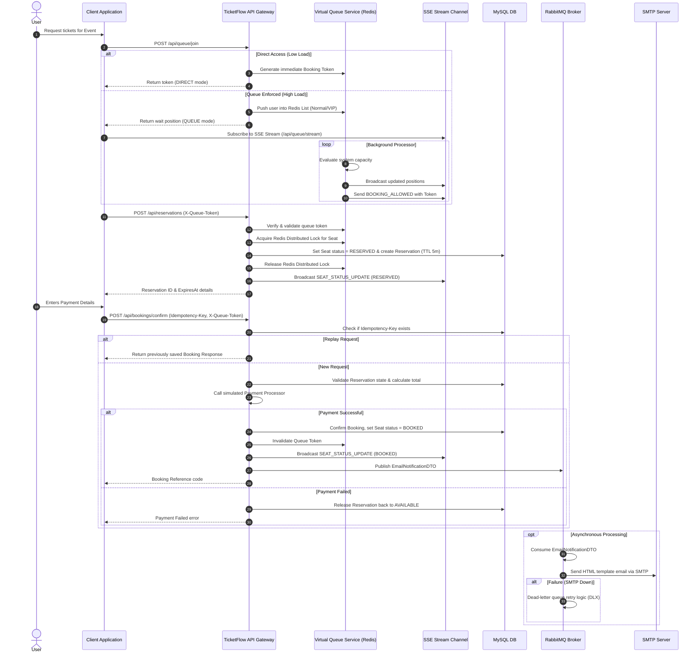

# TicketFlow

TicketFlow is a high-performance, concurrent, and resilient Spring Boot backend engine designed to handle high-demand event ticketing and seat booking. It integrates advanced system design patterns including token-based virtual queues, real-time status updates via Server-Sent Events (SSE), distributed seat locking, idempotent confirmations, asynchronous messaging, and robust fault-tolerance mechanisms.

---

## 🏗️ Architectural Overview & Booking Flow

TicketFlow uses a hybrid model of **MySQL** (for persistent relational integrity) and **Redis** (for high-speed locks, active user counts, and queuing lists).



---

## 🌟 Key Features & Technical Implementations

### 1. Advanced Virtual Queue System
To protect the backend database from sudden spikes in traffic (e.g., when ticket sales open), TicketFlow deploys a gatekeeper virtual queue:
*   **Dynamic Decisioning (`QueueDecisionService`)**: Evaluates system capacity, current request rate (RPS), and active active-session metrics to switch between **`DIRECT`** access (low load) and waiting queues (**`SOFT_QUEUE`** or **`HARD_QUEUE`**).
*   **FIFO & Priority Lanes**: Leverages Redis lists (`queue:{eventId}:vip` and `queue:{eventId}:normal`) to maintain strict order. Serves VIP users with early access and higher priority ratios.
*   **Server-Sent Events (SSE)**: Rather than resource-heavy polling, users subscribe to `/api/queue/stream`. The system pushes real-time updates for:
    *   `POSITION`: Current waiting placement and dynamic wait time updates.
    *   `BOOKING_ALLOWED`: Emitted when the queue processor admits the user, delivering a temporary `X-Queue-Token` allowing booking access.
    *   `EVENT_STATUS_UPDATE`: Live sales opening and closing alerts.
    *   `SEAT_STATUS_UPDATE`: Real-time changes in seat availability to enable live frontend map updates.

### 2. Distributed Locking & Concurrency Control
Double bookings and database race conditions are eliminated through a multi-tiered safety check:
*   **Redis Seat Locks (`RedisLockService`)**: Implements atomic distributed locking per seat using key strings (`lock:event:{eventId}:seat:{seatNumber}`). 
*   **Deadlock Prevention**: The service automatically sorts requested seat numbers alphabetically before acquiring locks sequentially, preventing circular wait deadlocks.
*   **Database Versioning**: The `Seat` table employs Hibernate `@Version` mapping to block stale database updates (optimistic locking) on concurrent requests.

### 3. Dynamic Sales & Booking Scheduling
Quartz Job Scheduling (stored durably in database tables via `spring.quartz.job-store-type=jdbc`) handles event states programmatically:
*   **`OpenBookingJob`**: Dynamically schedules the launch of booking (status transition to `OPEN`) matching the event's `saleStartTime`. Pushes the status change to active clients via SSE.
*   **`CloseBookingJob`**: Ends the booking availability (status transition to `CLOSED`) when the event date arrives.

### 4. Idempotence & Safe Confirmations
Payment confirmations support full idempotency to prevent duplicate charges or booking entries if connection drops occur mid-request:
*   **`Idempotency-Key` Validation**: Every confirm request expects a unique client-generated header.
*   **Database Check**: The system validates if the key exists before running transactions. If a match is found, it immediately responds with the original booking details without invoking payment processors or database alterations.

### 5. Resilient Messaging & Email Pipeline
When bookings are successful, confirmation emails are processed out-of-band using **RabbitMQ** to keep booking response times sub-millisecond:
*   **Decoupled Async Queue**: The booking service converts payloads and publishes to `ticketflow.email.exchange` with a 1-hour expiration.
*   **Fault-Tolerant Dead Letter Queue (DLQ)**: Configured with a dedicated DLX (`ticketflow.email.exchange.dlx`) and DLQ (`ticketflow.email.queue.dlq`).
*   **Exponential Backoff Retry**: When email processing fails (e.g., SMTP server timeouts), a stateless interceptor attempts a retry (up to 3 times, starting at 1000ms delay, double multiplier, up to 10s max delay) before discarding the message or routing it to the DLQ automatically.
*   **Rich HTML Layouts**: Processes Thymeleaf template (`booking-confirmation-email.html`) and sends HTML mail using Spring's `JavaMailSender`.

### 6. Observability & Monitoring
*   **Spring Boot Actuator**: Provides endpoint statistics, server health metrics, and thread states.
*   **Prometheus integration**: Exposes `/actuator/prometheus` scraping endpoint for Micrometer metrics.
*   **HikariCP Pool Tracking**: Monitors database connections (idle, active, pending, max connections) to tune Hikari performance.

---

## 🛠️ Technology Stack

*   **Backend Core**: Java 17, Spring Boot 3.5.6 (Web, Validation, AOP)
*   **Security & Auth**: Spring Security, JWT (jjwt-api 0.13.0)
*   **Caching & Queue Store**: Redis (Lettuce client with connection pool)
*   **Database & ORM**: MySQL, Spring Data JPA, Hibernate, Quartz JobStore JDBC
*   **Asynchronous Messaging**: RabbitMQ (AMQP Starter)
*   **Mailing**: JavaMailSender, Thymeleaf Template Engine
*   **API Specs**: Springdoc OpenAPI / Swagger UI 2.8.9
*   **Monitoring**: Micrometer, Prometheus, Actuator

---

## 🗂️ Project Package Structure

```text
src/main/java/com/deepak/ticketflow
├── Enum/              # Core domain status states (Booking, Event, Reservation, Role, UserType, etc.)
├── config/            # Infrastructure configurations (Security, Redis, RabbitMQ, Quartz, OpenAPI)
├── controller/        # REST controllers (Auth, Event, Queue, QueueStream, Booking)
├── dto/               # API Request/Response Transfer Objects (email payload structure, queue responses)
├── event/             # Application event definitions (e.g., BookingSlotFreedEvent)
├── filters/           # Custom filters (JWT filter, request metrics collector)
├── handlers/          # Global Exception controller advices and custom business exceptions
├── jobs/              # Quartz Job class definitions (OpenBookingJob, CloseBookingJob)
├── listener/          # Spring Application event listeners (e.g., QueueAdmissionListener)
├── model/             # JPA Entity schemas (Booking, Seat, Event, User, Reservation)
├── repository/        # Spring Data JPA repository mappings
└── service/           # Core business logic implementations (Booking, RedisLock, Payment, Mail)
    └── queue/         # Virtual Queue implementations (Throttling, Admission, Position calculators)
```

---

## 📡 API Endpoints

### 🔐 Authentication
| Method | Endpoint | Description | Auth Required |
| :--- | :--- | :--- | :--- |
| `POST` | `/register` | Register a new user account | Public |
| `POST` | `/login` | Authenticate credentials and return JWT Access + Refresh tokens | Public |
| `POST` | `/refresh` | Request a new JWT Access Token using a valid Refresh Token | Public |

### 📅 Event Management
| Method | Endpoint | Description | Auth Required |
| :--- | :--- | :--- | :--- |
| `GET` | `/events` | Get all configured events | Public |
| `GET` | `/events/{id}` | Retrieve details and seat map of a specific event | Public |
| `POST` | `/admin/events` | Create a new event | `ADMIN` Role |
| `POST` | `/seats` | Initialize seat allocations for an event | `ADMIN` Role |
| `DELETE` | `/events/{id}` | Delete an event | `ADMIN` Role |

### 👥 Virtual Queue
| Method | Endpoint | Description | Auth Required | Headers/Params |
| :--- | :--- | :--- | :--- | :--- |
| `POST` | `/api/queue/join` | Join waitlist or request a direct token | Authenticated | Request Body with `eventId`, `userType` |
| `GET` | `/api/queue/position` | Check current waitlist position and ETA | Authenticated | `eventId` (param), `userType` (param) |
| `GET` | `/api/queue/stream` | Subscribe to live Server-Sent Events (SSE) | Authenticated | `eventId` (param, optional) |
| `GET` | `/api/queue/test` | Trigger a test SSE payload validation message | Authenticated | None |

### 🎟️ Booking & Reservations
| Method | Endpoint | Description | Auth Required | Headers/Params |
| :--- | :--- | :--- | :--- | :--- |
| `POST` | `/api/reservations` | Place a temporary 5-minute hold on selected seats | Authenticated | `X-Queue-Token` (header), Request Body |
| `POST` | `/api/bookings/confirm` | Finalize payment and commit the ticket reservation | Authenticated | `X-Queue-Token` (header), `Idempotency-Key` (header) |

---

## ⚙️ Configuration Parameters (`application.properties`)

Key parameters in `src/main/resources/application.properties` that control the application:

```properties
# MySQL Connection
spring.datasource.url=jdbc:mysql://localhost:3306/ticketflow
spring.datasource.username=your-username
spring.datasource.password=your-password

# Hikari Connection Pool Settings
spring.datasource.hikari.maximum-pool-size=20
spring.datasource.hikari.minimum-idle=5

# Redis Server Connection
spring.redis.host=localhost
spring.redis.port=6379

# RabbitMQ Settings
spring.rabbitmq.host=localhost
spring.rabbitmq.port=5672
spring.rabbitmq.email.exchange=ticketflow.email.exchange
spring.rabbitmq.email.queue=ticketflow.email.queue
spring.rabbitmq.email.routing-key=email.notification

# SMTP Server Configurations (GMail Example)
spring.mail.host=smtp.gmail.com
spring.mail.port=587
spring.mail.username=your-email@gmail.com
spring.mail.password=your-app-password
ticketflow.email.from=your-email@gmail.com

# Quartz Job Details Configuration
spring.quartz.job-store-type=jdbc
spring.quartz.jdbc.initialize-schema=always
```

---

## 🚀 Setting Up & Running Locally

### 📋 Prerequisites
1.  **Java SDK 17** installed and added to paths.
2.  **MySQL Server** running. Create the target schema:
    ```sql
    CREATE DATABASE ticketflow;
    ```
3.  **Redis Server** active on default port `6379`.
4.  **RabbitMQ Server** active on default port `5672`.

### 🏁 Start Application
Run the boot app using the Maven wrapper:

**On Linux/macOS:**
```bash
./mvnw spring-boot:run
```

**On Windows (Command Prompt/PowerShell):**
```powershell
.\mvnw.cmd spring-boot:run
```

Once running, you can access:
*   **API Base Path**: `http://localhost:8080/`
*   **Swagger OpenAPI Interface**: [http://localhost:8080/swagger-ui/index.html](http://localhost:8080/swagger-ui/index.html)
*   **Metrics Scraping Port**: [http://localhost:8080/actuator/prometheus](http://localhost:8080/actuator/prometheus)

### 🧪 Test Executions
To build, clean, and run tests:
```bash
./mvnw clean test
```
To assemble a jar artifact:
```bash
./mvnw clean package
```
